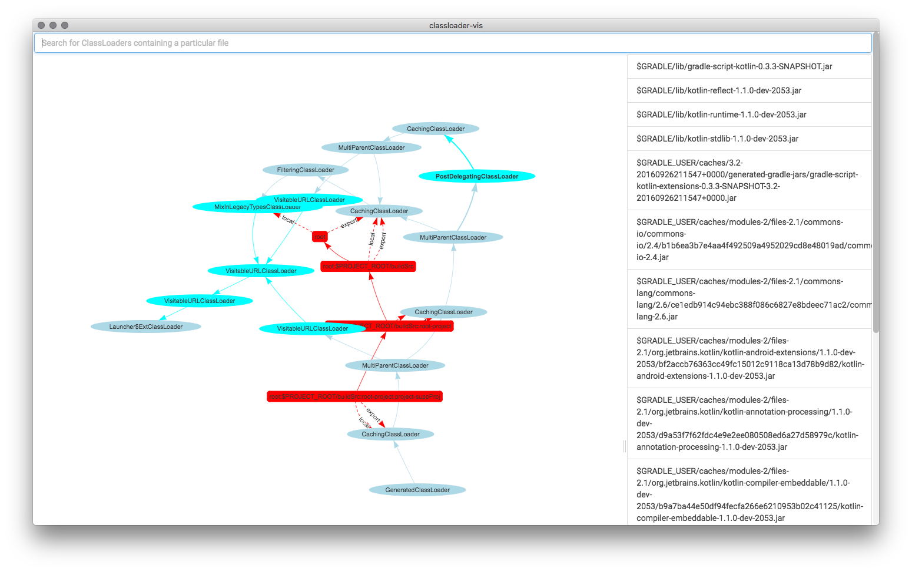

# classloader-vis

The Gradle ClassLoader hierarchy visualization tool.

## Build

Download required dependencies once with:

    ./prepare

Build the production version with:

    ./build-min

Run it with:

    ./run

`COMMAND-O` to select the `ClassLoaderHierarchy.json` file to visualize.
